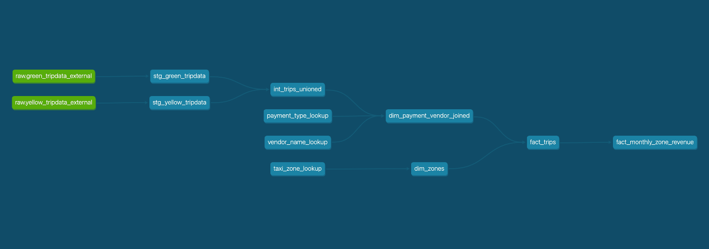

# Analytical engineering with DBT

## Overview
This dbt project transforms raw taxi trip data into analytics-ready models using BigQuery as the data warehouse.

## Project Structure

```
dbt/
├── models/             # dbt models organized by layer
│   ├── staging/        # Raw data transformations (stg_*)
│   ├── intermediate/   # Business logic layer (int_*)
│   └── marts/          # Final analytics tables (dim_*, fact_*)
├── macros/             # Reusable SQL/Jinja macros
├── seeds/              # Static reference data (CSV files)
```

## Lineage


## Setup

1. Install dependencies:
    ```bash
    dbt deps
    ```

2. Configure your `profiles.yml` with BigQuery credentials. You could move edited profiles.yml file to `~/.dbt/profiles.yml`.

3. Run the project:
    ```bash
    rm profiles.yml
    dbt seed --target homework/prod/dev
    dbt run --target homework/prod/dev
    ```

## Key Models

- **Staging**: `stg_green_tripdata`, `stg_yellow_tripdata`
- **Intermediate**: Trip union, payment type and vendor lookups
- **Marts**: Dimensional tables (zones, vendors) and fact tables (trips, monthly revenue)

## Testing

Run data quality tests:
```bash
dbt test
```

## Documentation

Generate and view dbt docs:
```bash
dbt docs generate
dbt docs serve
```